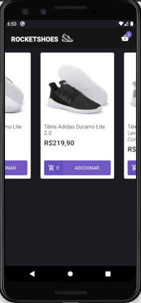
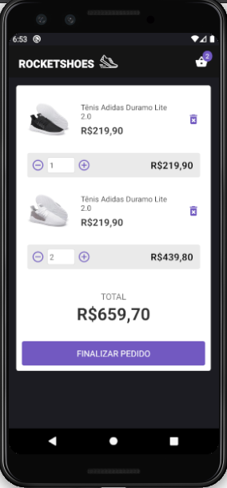

# Rocketshoes Mobile

Rocketshoes mobile é um projeto de e-commerce criado durante o desafio do Bootcamp GoStack 8.0 da Rocketseat. Nesta aplicação temos uma página para listar os produtos e outra página que lista os produtos do carrinho de compras

## A Aplicação

Foi implementado o front-end e backend da aplicação

Está disponibilizada uma fake REST API para a aplicação criada utilizando JSON Server, caso deseje testar a aplicação sem precisar cadastrar produtos.

## Funcionalidades do Frontend

- Vizualização dos produtos disponíveis
- Adicionar produto ao carrinho de compras
- Verifica se existe a quantidade pedida do produto no estoque antes de adicionar ao carrinho
- Possibilidade de editar a quantidade do produto no carrinho e removê-lo do carrinho
- Apresenta o valor total da compra e o sub-total para cada item do carrinho

### Ferramentas utilizadas no Frontend

- React, React Native
- ESLint + Prettier + EditorConfig
- Polished
- Styled-components
- Reactotron
- Immer
- React Navigation
- React Hooks
- Redux
- Sagas

## Funcionalidades do Backend

- Cadastro de produtos
- Criar e modificar estoques para os produtos cadastrados

### Ferramentas utilizadas no Backend

- NodeJS
- Express
- Sucrase + Nodemon
- ESLint + Prettier + EditorConfig
- Sequelize (Utilizando PostgresSQL)
- Docker
